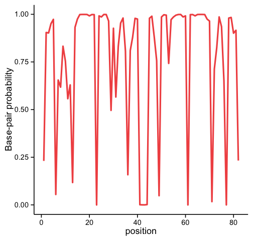

# centroid_bpp.py
* Author: Soh Ishiguro

`centroid_bpp.py` is tiny command line tool that allow us to show base-pair probability each base
position from given bppm file. Input bppm file is generated by following command:

`centroid_fold --posteriors 0.0001 --oposteriors out.bppm --postscript out.ps -o out.out out.fa`

## Usage
`python centroid_bpp.py --help` # show help messages.
`python centroid_bpp.py --file example.bppm > out.log`

out.log has base-pair probability per base, then you can plot of this distribution by simple R code.

```R
library(ggplot2)
d <- read.csv("test.log", header=F)
names(d) <- c("pos", "prob")
ggplot(d, aes(x=pos, y=prob)) + geom_line(colour="brown2", size=1) + theme_classic() + labs(y="Base-pair probability", x="position")
```


